# Entity Relationship Diagram and Validation Rules

## Overview
This document provides the complete entity relationship diagram (ERD) and comprehensive validation rules for the auction engine database schema, ensuring data integrity, referential consistency, and business rule compliance across all 13 auction types.

## Entity Relationship Diagram

```mermaid
erDiagram
    %% Core Auction Entities
    auctions ||--o{ auction_items : contains
    auctions ||--o{ auction_configurations : has
    auctions ||--o{ bids : receives
    auctions ||--o{ notifications : generates
    auctions ||--o{ real_time_events : triggers
    auctions ||--o{ rule_configurations : configures
    auctions ||--o{ audit_trail : audits

    %% User Management
    users ||--o{ user_profiles : has
    users ||--o{ user_preferences : has
    users ||--o{ bids : places
    users ||--o{ notifications : receives
    users ||--o{ websocket_connections : maintains
    users ||--o{ audit_trail : performs

    %% Bid Management
    bids ||--o{ bid_history : tracks
    bids ||--o{ bid_retractions : manages
    bids ||--o{ notifications : triggers
    bids ||--o{ real_time_events : generates
    bids ||--o{ audit_trail : logs

    %% Business Rules
    rules ||--o{ rule_configurations : configures
    rules ||--o{ rule_violations : detects
    rule_configurations ||--o{ rule_violations : validates
    rule_violations ||--o{ audit_trail : records

    %% Real-time Features
    websocket_connections ||--o{ real_time_events : streams
    notifications ||--o{ audit_trail : logs

    %% System Monitoring
    system_events ||--o{ audit_trail : correlates
    immutable_logs }o--|| audit_trail : preserves

    %% Detailed Cardinality
    auctions {
        uuid auction_id PK
        enum auction_type
        enum status
        timestamp start_time
        timestamp end_time
        decimal current_price
        uuid created_by FK
    }

    auction_items {
        uuid item_id PK
        uuid auction_id FK
        varchar title
        text description
        integer quantity
        decimal starting_bid
    }

    auction_configurations {
        uuid config_id PK
        uuid auction_id FK
        varchar config_key
        json config_value
        varchar data_type
    }

    bids {
        uuid bid_id PK
        uuid auction_id FK
        uuid user_id FK
        uuid item_id FK
        decimal bid_amount
        integer quantity
        enum bid_type
        enum status
        timestamp submitted_at
    }

    bid_history {
        uuid history_id PK
        uuid bid_id FK
        uuid auction_id FK
        enum event_type
        enum old_status
        enum new_status
        timestamp occurred_at
    }

    bid_retractions {
        uuid retraction_id PK
        uuid bid_id FK
        uuid auction_id FK
        uuid user_id FK
        enum retraction_reason
        timestamp requested_at
        enum status
    }

    users {
        uuid user_id PK
        varchar username
        varchar email
        varchar password_hash
        enum user_role
        enum account_status
        boolean email_verified
    }

    user_profiles {
        uuid profile_id PK
        uuid user_id FK
        varchar first_name
        varchar last_name
        varchar country
        enum kyc_status
        decimal risk_score
    }

    user_preferences {
        uuid preference_id PK
        uuid user_id FK
        varchar preference_category
        varchar preference_key
        json preference_value
    }

    rules {
        uuid rule_id PK
        varchar rule_code
        varchar rule_name
        text description
        enum rule_category
        json auction_types
        enum severity
        json condition_logic
    }

    rule_configurations {
        uuid config_id PK
        uuid rule_id FK
        uuid auction_id FK
        varchar scope
        json config_values
        boolean is_override
    }

    rule_violations {
        uuid violation_id PK
        uuid rule_id FK
        uuid auction_id FK
        uuid user_id FK
        uuid bid_id FK
        enum violation_type
        enum severity
        json violation_data
    }

    notifications {
        uuid notification_id PK
        uuid user_id FK
        uuid auction_id FK
        uuid bid_id FK
        enum notification_type
        enum category
        enum priority
        varchar title
        text message
        enum status
    }

    websocket_connections {
        uuid connection_id PK
        uuid user_id FK
        varchar session_id
        varchar socket_id
        enum connection_status
        json subscriptions
        timestamp connected_at
    }

    real_time_events {
        uuid event_id PK
        varchar event_type
        enum event_category
        uuid auction_id FK
        uuid user_id FK
        uuid bid_id FK
        json event_data
        bigint sequence_number
        enum priority
    }

    audit_trail {
        uuid audit_id PK
        varchar table_name
        uuid record_id
        enum operation
        uuid user_id FK
        uuid auction_id FK
        json old_values
        json new_values
        timestamp occurred_at
    }

    system_events {
        uuid event_id PK
        varchar event_type
        enum event_category
        enum severity
        varchar source
        text message
        json details
        timestamp occurred_at
    }

    immutable_logs {
        uuid log_id PK
        bigint log_sequence
        enum log_type
        varchar retention_period
        json content
        varchar content_hash
        varchar previous_hash
        text digital_signature
        timestamp timestamp
    }
```



## Validation Rules by Entity

### 1. auctions Table Validation Rules

#### Data Type Validations
- `auction_id`: Must be valid UUID format
- `auction_type`: Must be one of 13 supported types
- `status`: Must follow valid state transitions
- `start_time`: Must be before `end_time`
- `current_price`: Must be >= 0 when set
- `reserve_price`: Must be > 0 when set
- `min_bid_increment`: Must be > 0

#### Business Logic Validations
- **Auction Duration**: `end_time - start_time` must be between 1 minute and 30 days
- **Reserve Price Logic**: If set, must be >= starting_price
- **Status Consistency**: Active auctions must have current_price set for applicable types
- **Time Zone Consistency**: All timestamps must be in UTC

#### Cross-Table Validations
- `created_by` must reference active user account
- Must have at least one associated auction_item
- Must have required auction_type-specific configurations

### 2. bids Table Validation Rules

#### Data Type Validations
- `bid_amount`: Must be > 0 and have maximum 2 decimal places
- `quantity`: Must be >= 1 for multi-unit auctions
- `submitted_at`: Must be between auction start_time and end_time
- `max_proxy_amount`: Must be >= bid_amount when set

#### Business Logic Validations
- **Minimum Increment**: bid_amount >= current_price + min_bid_increment (English/Vickrey)
- **Maximum Bid**: bid_amount <= user's maximum bid limit (if configured)
- **Quantity Limits**: quantity between min_quantity and max_quantity (multi-unit)
- **Package Completeness**: All required items must be included (combinatorial)

#### Cross-Table Validations
- `auction_id` must reference active auction
- `user_id` must reference active, verified user account
- `item_id` must belong to the specified auction
- User must not exceed maximum bids per auction limit

### 3. users Table Validation Rules

#### Data Type Validations
- `username`: 3-50 characters, alphanumeric + underscore only
- `email`: Valid email format, unique across all users
- `password_hash`: Must be properly salted hash
- `account_status`: Must be valid status for user operations

#### Business Logic Validations
- **Email Verification**: Required for bidding on high-value auctions
- **KYC Requirements**: Must be completed for auctions above threshold amount
- **Account Age**: New accounts may have bidding limits
- **Risk Score**: Users with high risk scores may have restricted access

#### Cross-Table Validations
- Must have associated user_profile record
- May have associated user_preferences (created automatically)
- Cannot be deleted if has active bids or auctions

### 4. rules Table Validation Rules

#### Data Type Validations
- `rule_code`: Must be unique, follow naming convention
- `auction_types`: Must contain valid auction type codes
- `condition_logic`: Must be valid JSON with required structure
- `validation_expression`: Must be syntactically valid

#### Business Logic Validations
- **Rule Conflicts**: Cannot have conflicting rules for same auction type
- **Performance Impact**: High-impact rules require approval
- **Dependency Order**: Dependent rules must be evaluated in correct order
- **Version Control**: New versions must maintain backward compatibility

## Referential Integrity Rules

### Cascade Behaviors

```sql
-- Auction deletion cascades
ALTER TABLE auction_items
ADD CONSTRAINT fk_auction_items_auction
FOREIGN KEY (auction_id) REFERENCES auctions(auction_id)
ON DELETE CASCADE;

ALTER TABLE auction_configurations
ADD CONSTRAINT fk_auction_configs_auction
FOREIGN KEY (auction_id) REFERENCES auctions(auction_id)
ON DELETE CASCADE;

-- Bid deletion cascades
ALTER TABLE bid_history
ADD CONSTRAINT fk_bid_history_bid
FOREIGN KEY (bid_id) REFERENCES bids(bid_id)
ON DELETE CASCADE;

ALTER TABLE bid_retractions
ADD CONSTRAINT fk_bid_retractions_bid
FOREIGN KEY (bid_id) REFERENCES bids(bid_id)
ON DELETE CASCADE;

-- User deletion restrictions
ALTER TABLE user_profiles
ADD CONSTRAINT fk_user_profiles_user
FOREIGN KEY (user_id) REFERENCES users(user_id)
ON DELETE CASCADE;

ALTER TABLE user_preferences
ADD CONSTRAINT fk_user_preferences_user
FOREIGN KEY (user_id) REFERENCES users(user_id)
ON DELETE CASCADE;

-- Rule deletion cascades
ALTER TABLE rule_configurations
ADD CONSTRAINT fk_rule_configs_rule
FOREIGN KEY (rule_id) REFERENCES rules(rule_id)
ON DELETE CASCADE;

ALTER TABLE rule_violations
ADD CONSTRAINT fk_rule_violations_rule
FOREIGN KEY (rule_id) REFERENCES rules(rule_id)
ON DELETE CASCADE;
```

### Soft Delete Strategy

For audit compliance, implement soft deletes for critical entities:

```sql
-- Add soft delete columns
ALTER TABLE auctions ADD COLUMN deleted_at TIMESTAMP NULL;
ALTER TABLE bids ADD COLUMN deleted_at TIMESTAMP NULL;
ALTER TABLE users ADD COLUMN deleted_at TIMESTAMP NULL;

-- Soft delete constraints
CREATE INDEX idx_auctions_not_deleted ON auctions (auction_id) WHERE deleted_at IS NULL;
CREATE INDEX idx_bids_not_deleted ON bids (bid_id) WHERE deleted_at IS NULL;
CREATE INDEX idx_users_not_deleted ON users (user_id) WHERE deleted_at IS NULL;
```

## Business Logic Constraints

### Auction State Transition Rules

```sql
-- Valid auction status transitions
CREATE TABLE valid_auction_transitions (
    from_status VARCHAR(20),
    to_status VARCHAR(20),
    requires_approval BOOLEAN DEFAULT FALSE,
    PRIMARY KEY (from_status, to_status)
);

INSERT INTO valid_auction_transitions VALUES
('draft', 'scheduled', FALSE),
('scheduled', 'active', FALSE),
('active', 'paused', TRUE),
('paused', 'active', TRUE),
('active', 'completed', FALSE),
('active', 'cancelled', TRUE),
('scheduled', 'cancelled', FALSE);
```

### Bid State Validation Rules

```sql
-- Bid status must be consistent with auction status
ALTER TABLE bids ADD CONSTRAINT chk_bid_auction_consistency
CHECK (
    (auction_id IN (SELECT auction_id FROM auctions WHERE status = 'active'))
    OR status IN ('retracted', 'outbid', 'losing')
);

-- Proxy bid validation
ALTER TABLE bids ADD CONSTRAINT chk_proxy_bid_valid
CHECK (
    (bid_type != 'proxy') OR
    (bid_type = 'proxy' AND max_proxy_amount IS NOT NULL AND max_proxy_amount >= bid_amount)
);
```

### User Permission Validation

```sql
-- Users can only bid on active auctions
ALTER TABLE bids ADD CONSTRAINT chk_user_can_bid
CHECK (
    user_id IN (SELECT user_id FROM users WHERE account_status = 'active') AND
    auction_id IN (SELECT auction_id FROM auctions WHERE status = 'active')
);

-- Admin users required for certain operations
ALTER TABLE rule_violations ADD CONSTRAINT chk_admin_resolution
CHECK (
    (status != 'resolved') OR
    (status = 'resolved' AND resolved_by IN (SELECT user_id FROM users WHERE user_role IN ('admin', 'moderator')))
);
```

## Data Consistency Rules

### Cross-Table Consistency Checks

```sql
-- Auction current_price must match highest active bid
CREATE OR REPLACE FUNCTION validate_auction_current_price()
RETURNS TRIGGER AS $$
BEGIN
    IF NEW.auction_type IN ('english', 'vickrey') AND NEW.status = 'active' THEN
        UPDATE auctions
        SET current_price = (
            SELECT COALESCE(MAX(bid_amount), starting_price)
            FROM bids
            WHERE auction_id = NEW.auction_id AND status = 'active'
        )
        WHERE auction_id = NEW.auction_id;
    END IF;
    RETURN NEW;
END;
$$ LANGUAGE plpgsql;

-- Bid total_amount must equal bid_amount * quantity
ALTER TABLE bids ADD CONSTRAINT chk_bid_total_calculation
CHECK (total_amount = bid_amount * quantity);

-- User preferences must reference valid configuration keys
ALTER TABLE user_preferences ADD CONSTRAINT chk_valid_preference_key
CHECK (
    preference_key IN (
        'default_bid_increment', 'max_bid_amount', 'auto_bid_enabled',
        'bid_confirmation_required', 'favorite_auction_types', 'excluded_auction_types'
    )
);
```

### Real-time Consistency Requirements

```sql
-- WebSocket connections must have valid subscriptions
ALTER TABLE websocket_connections ADD CONSTRAINT chk_valid_subscriptions
CHECK (
    jsonb_typeof(subscriptions) = 'object' AND
    subscriptions ? 'auction_subscriptions' AND
    subscriptions ? 'event_types'
);

-- Real-time events must have valid sequence numbers
ALTER TABLE real_time_events ADD CONSTRAINT chk_event_sequence
CHECK (
    sequence_number > 0 AND
    (previous_event_id IS NULL OR
     EXISTS(SELECT 1 FROM real_time_events WHERE event_id = previous_event_id))
);
```

## Performance Validation Rules

### Query Performance Constraints

```sql
-- Critical queries must meet performance targets
ALTER TABLE bids ADD CONSTRAINT chk_bid_performance
CHECK (
    -- Ensure submitted_at index provides fast lookups
    submitted_at IS NOT NULL
);

-- Real-time event queries must be optimized
CREATE INDEX CONCURRENTLY idx_performance_critical
ON real_time_events (auction_id, sequence_number DESC, generated_at DESC)
WHERE priority IN ('high', 'critical');
```

### Data Volume Constraints

```sql
-- Partition large tables by time
ALTER TABLE audit_trail ADD CONSTRAINT chk_audit_partitioning
CHECK (
    occurred_at >= DATE_TRUNC('month', occurred_at) AND
    occurred_at < DATE_TRUNC('month', occurred_at) + INTERVAL '1 month'
);

-- Limit bid history retention
ALTER TABLE bid_history ADD CONSTRAINT chk_history_retention
CHECK (
    occurred_at > NOW() - INTERVAL '1 year'
);
```

## Compliance and Security Validation

### GDPR Compliance Rules

```sql
-- Personal data handling
ALTER TABLE users ADD CONSTRAINT chk_gdpr_consent
CHECK (
    (email_verified = FALSE) OR
    (data_collection_consent = TRUE)
);

-- Data retention limits
ALTER TABLE notifications ADD CONSTRAINT chk_notification_retention
CHECK (
    created_at > NOW() - INTERVAL '90 days' OR
    category = 'system'
);
```

### Security Validation Rules

```sql
-- Password security requirements
ALTER TABLE users ADD CONSTRAINT chk_password_security
CHECK (
    LENGTH(password_hash) >= 60 AND  -- bcrypt minimum
    login_attempts <= 5 AND
    (locked_until IS NULL OR locked_until > NOW())
);

-- IP tracking for fraud detection
ALTER TABLE bids ADD CONSTRAINT chk_ip_tracking
CHECK (
    (ip_address IS NOT NULL) OR
    (bid_source = 'system')
);
```

## Database-Specific Validation Examples

### PostgreSQL Specific Validations

```sql
-- Use PostgreSQL's advanced constraint features
ALTER TABLE auctions ADD CONSTRAINT chk_auction_timing
EXCLUDE USING GIST (
    auction_id WITH =,
    tstzrange(start_time, end_time) WITH &&
) WHERE (status = 'active');

-- JSON schema validation
ALTER TABLE auction_configurations ADD CONSTRAINT chk_config_json_schema
CHECK (
    jsonb_typeof(config_value) IN ('number', 'string', 'boolean', 'object', 'array')
);
```

### MySQL Specific Validations

```sql
-- Use MySQL's ENUM constraints effectively
ALTER TABLE auctions MODIFY COLUMN auction_type ENUM(
    'english', 'dutch', 'sealed_bid', 'reverse', 'vickrey',
    'buy_it_now', 'double', 'all_pay', 'japanese', 'chinese',
    'penny', 'multi_unit', 'combinatorial'
) NOT NULL;

-- Full-text search constraints
ALTER TABLE auction_items ADD FULLTEXT idx_items_search (title, description);
```

This comprehensive validation framework ensures data integrity, referential consistency, business rule compliance, and performance optimization across the entire auction engine database schema.