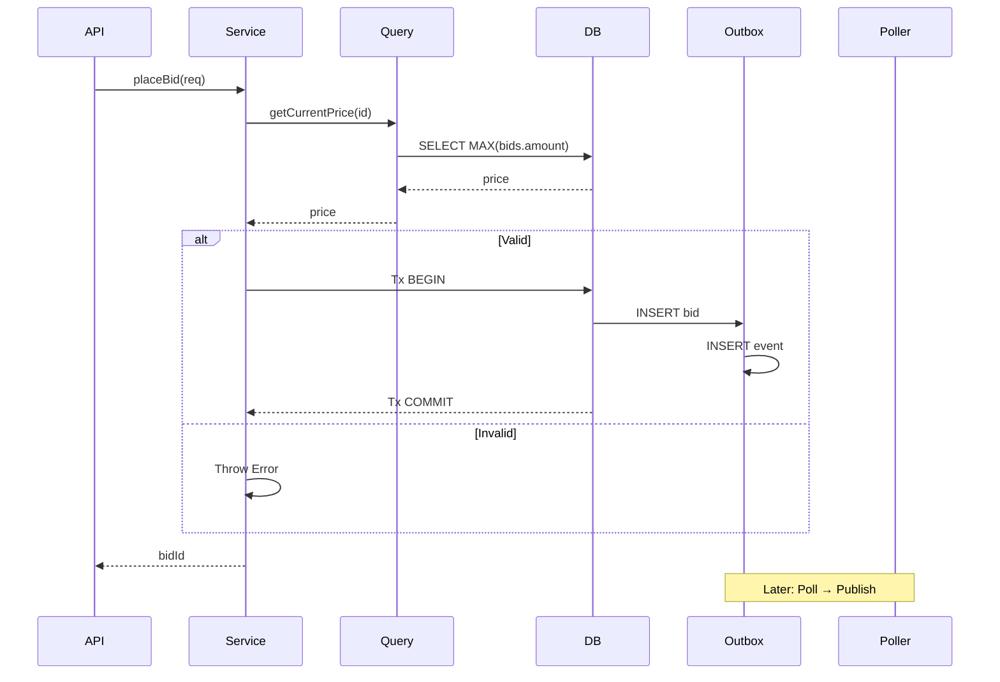
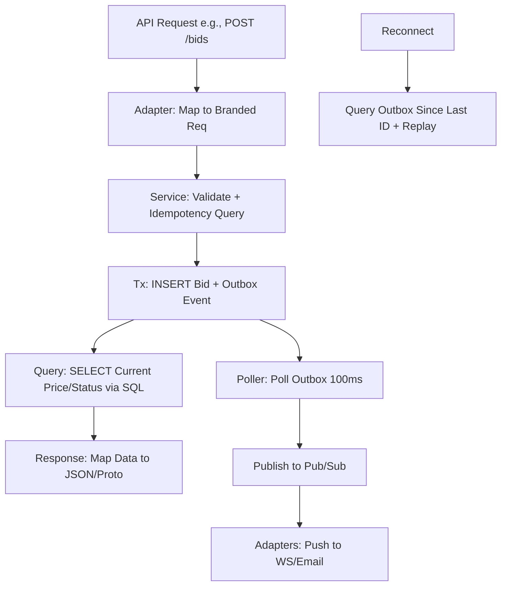

# Comprehensive Architectural Layers Design for Auction Engine

## Overview

This document presents a revised architectural layers design for the auction engine, adopting a thin, high-performance DB wrapper approach. The database serves as the single source of truth, with all storage, state management, and computations (e.g., winner determination, current prices, bids) offloaded to SQL queries, views, and stored procedures via Drizzle ORM. This eliminates in-memory entities, factories, hydration layers, and stateful components, focusing on stateless query builders, direct DB abstractions, and indexed SQL for zero-copy performance. The design aligns with PRD principles: no in-memory state, DB-centric reliability, performance via indexing (see docs/0-2-indexing-strategy-performance.md), and SQL-based winner determination (see docs/0-3-winner-determination-sql-queries.md).

The architecture supports 13 auction types across multiple databases, API interfaces, and notification mechanisms while maintaining high cohesion and low coupling between layers.

## 1. Domain Layer - Query Interfaces and Branded Types

### Purpose and Responsibility
The Domain Layer defines type-safe interfaces for stateless query operations and branded types for data integrity. All business logic (e.g., status determination, pricing, winner selection) is offloaded to SQL queries/views/stored procedures in the database, ensuring the DB as single source of truth. No rich domain entities or in-memory state; results are plain objects mapped via Drizzle ORM for zero-copy performance.

### Branded Types and Data Objects
Use branded types for all IDs, amounts, and statuses to enforce type safety without runtime overhead (see docs/0-7-branded-types.md).

```typescript
import { Brand } from '../types/branded-types';

// Branded primitives
export type TAuctionId = Brand<string, 'AuctionId'>;
export type TBidId = Brand<string, 'BidId'>;
export type TUserId = Brand<string, 'UserId'>;
export type Money = Brand<number, 'Money'>; // e.g., Brand<bigint, 'Money'> for precision

// Plain data objects (POJOs) from DB rows
export interface AuctionData {
  id: TAuctionId;
  title: string;
  description: string;
  type: AuctionType; // string enum
  startTime: Date;
  endTime: Date;
  startingPrice: Money;
  reservePrice?: Money;
  minIncrement: Money;
  status: AuctionStatus; // Computed via SQL CASE
  version: number; // For optimistic locking
}

export interface BidData {
  id: TBidId;
  auctionId: TAuctionId;
  bidderId: TUserId;
  amount: Money;
  timestamp: Date;
  status: BidStatus;
  isWinning: boolean; // Computed via SQL window function
}

export interface UserData {
  id: TUserId;
  username: string;
  email: string;
  roles: UserRole[];
}

// Enums (DB-mapped)
export enum AuctionType {
  ENGLISH = 'english',
  DUTCH = 'dutch',
  // ... all 13 types from PRD
}

export enum AuctionStatus {
  DRAFT = 'draft',
  ACTIVE = 'active',
  // ... computed via SQL: CASE WHEN NOW() < start_time THEN 'scheduled' WHEN NOW() > end_time THEN 'completed' ELSE 'active' END
}
```

### Query Interfaces
Stateless interfaces for DB queries, implemented via Drizzle abstractions. All methods are async, parameterized, and return plain data.

```typescript
// Core auction queries
export interface IAuctionQueries {
  getAuctionData(id: TAuctionId): Promise<AuctionData | null>; // SELECT * FROM auctions WHERE id = ?
  getCurrentPrice(id: TAuctionId): Promise<Money>; // SELECT COALESCE(MAX(b.amount), a.starting_price) FROM auctions a LEFT JOIN bids b ON a.id = b.auction_id WHERE a.id = ?
  getStatus(id: TAuctionId): Promise<AuctionStatus>; // CASE on timestamps/bids count
  canPlaceBid(auctionId: TAuctionId, amount: Money): Promise<boolean>; // Check status, amount > current_price + increment, etc., via SQL
  createAuction(config: CreateAuctionConfig): Promise<TAuctionId>; // INSERT INTO auctions ... RETURNING id (in tx)
  updateAuction(id: TAuctionId, updates: Partial<AuctionData>): Promise<void>; // UPDATE ... WHERE id = ?
}

// Bid queries
export interface IBidQueries {
  placeBid(req: PlaceBidRequest): Promise<TBidId>; // Idempotency check SELECT, then INSERT ... RETURNING id (in tx)
  getBidsByAuction(auctionId: TAuctionId): Promise<BidData[]>;
  getWinningBids(auctionId: TAuctionId): Promise<BidData[]>; // Using ROW_NUMBER() OVER (ORDER BY amount DESC)
  retractBid(bidId: TBidId): Promise<void>; // UPDATE status = 'retracted' WHERE id = ?
}

// Winner determination (offloaded to SQL per auction type)
export interface IWinnerQueries {
  determineWinner(auctionId: TAuctionId, type: AuctionType): Promise<UserData | null>; // Parameterized SQL from docs/0-3-winner-determination-sql-queries.md, e.g., for English: SELECT bidder_id FROM (SELECT *, ROW_NUMBER() OVER (ORDER BY amount DESC) rn FROM bids WHERE auction_id = ? AND status = 'active') WHERE rn = 1
  determineWinnersMultiUnit(auctionId: TAuctionId, units: number): Promise<Map<TUserId, number>>; // SQL with LATERAL or aggregates
  // Supports all 13 types via CASE or type-parameterized views
}

// Value Objects (thin, DB-mapped)
export class Money {
  constructor(public readonly amount: number, public readonly currency: string) {}
  static fromDb(value: {amount: number; currency: string}): Money { return new Money(value.amount, value.currency); }
  add(other: Money): Money { return new Money(this.amount + other.amount, this.currency); }
  isGreaterThan(other: Money): boolean { return this.amount > other.amount; }
}
```

No factories, rehydrators, or aggregates: All state is DB-resident; queries are executed on-demand.

### Testing Strategy
- **Type Tests**: Ensure branded types prevent invalid inputs (TypeScript compile-time).
- **Query Unit Tests**: Mock Drizzle/DB with sql-template-strings or jest mocks for SQL validation (e.g., test getCurrentPrice returns MAX bid).
- **SQL Integration Tests**: Use real DB (Testcontainers) to verify queries against schemas/indexes (docs/0-2-indexing-strategy-performance.md).
- **Edge Cases**: Test zero bids (fallback to starting_price), invalid types, concurrency (tx isolation).
- **Performance**: Benchmark zero-copy mapping with Drizzle rowToObject.

## 2. Query Access Patterns - Direct DB Abstractions

### Purpose and Responsibility
With the stateless query approach, traditional repositories are eliminated. Data access is handled directly via Drizzle ORM query builders in dedicated query modules (e.g., src/database/queries/auction-queries.ts). This avoids entity mapping overhead, leveraging DB indexes and SQL for all filtering/sorting/pagination. Optional QueryCriteria supports dynamic/ad-hoc queries where fixed methods aren't sufficient.

### QueryCriteria for Dynamic Access
For flexible searches (e.g., auctions by custom filters), use a lightweight criteria builder that translates to Drizzle SQL.

```typescript
interface QueryCriteria {
  filters?: QueryFilter[]; // e.g., [{field: 'status', operator: 'equals', value: 'active'}]
  sortBy?: SortCriteria[]; // e.g., [{field: 'endTime', direction: 'ASC'}]
  pagination?: { limit: number; offset: number };
  // No 'includes' - use SQL JOINs for relations
}

interface QueryFilter {
  field: string;
  operator: 'eq' | 'neq' | 'gt' | 'lt' | 'like' | 'in';
  value: any;
}

interface SortCriteria {
  field: string;
  direction: 'ASC' | 'DESC';
}

// Usage in query interface (extended)
export interface IAuctionQueries {
  // ... previous methods
  findAuctions(criteria?: QueryCriteria): Promise<AuctionData[]>; // Drizzle: db.select().from(auctions).where(buildWhere(criteria)).orderBy(buildOrder(criteria)).limit(criteria?.pagination?.limit)
}
```

### Implementation via Drizzle
Queries are built using Drizzle's type-safe API or raw SQL templates for complex logic (e.g., winner determination). No domain mapping; direct row-to-POJO via Drizzle's zero-copy hydration. Try to keep the field names consistent between the database and Typescript so as to avoid explicit marshalling between database fields and Typescript objects.

```typescript
// Example in auction-queries.ts
import { db } from '../drizzle-adapter';
import { sql } from 'drizzle-orm';
import { auctions, bids } from '../schema'; // Drizzle schema

export class AuctionQueries implements IAuctionQueries {
  async getCurrentPrice(id: TAuctionId): Promise<Money> {
    const result = await db
      .select({ maxAmount: sql<number>`COALESCE(MAX(${bids.amount}), ${auctions.startingPrice})` })
      .from(auctions)
      .leftJoin(bids, eq(bids.auctionId, auctions.id))
      .where(eq(auctions.id, id))
      .execute();
    return Money.fromDb({ amount: result[0].maxAmount, currency: 'USD' });
  }

  async findAuctions(criteria?: QueryCriteria): Promise<AuctionData[]> {
    let query = db.select().from(auctions);
    if (criteria?.filters) {
      // Build dynamic WHERE with Drizzle conditions
      criteria.filters.forEach(f => {
        switch (f.operator) {
          case 'eq': query = query.where(eq(sql`${f.field}`, f.value)); break;
          // ... other operators
        }
      });
    }
    if (criteria?.sortBy) {
      // Apply ORDER BY
    }
    if (criteria?.pagination) {
      query = query.limit(criteria.pagination.limit).offset(criteria.pagination.offset);
    }
    return query.execute(); // Returns AuctionData[] directly
  }

  // Leverage indexes: e.g., for findActiveAuctions, use idx_auctions_status_endtime
}
```

All access is stateless: Inject Drizzle instance or use global db; execute per request.

### Testing Strategy
- **Query Unit Tests**: Mock Drizzle with vi.mock('drizzle-orm') to test SQL generation and criteria translation.
- **Integration Tests**: Run against test DB to validate results against expected SQL (use EXPLAIN ANALYZE for index usage).
- **Performance Tests**: Benchmark query times with pgBadger or Drizzle's query logging; ensure <10ms for common ops via indexes (docs/0-2-indexing-strategy-performance.md).
- **Dynamic Criteria Tests**: Verify filter/operator combinations produce correct SQL and handle edge cases (e.g., empty results, large offsets).

## 3. Database Layer - Drizzle ORM Abstraction

### Purpose and Responsibility
The Database Layer uses Drizzle ORM as the primary abstraction for type-safe, performant SQL interactions across PostgreSQL (primary), MySQL, and SQLite. It handles schema definitions, query building, migrations, transactions, and connection pooling. All computations (e.g., aggregates, CASE logic) are in SQL; Drizzle enables zero-copy row mapping to branded POJOs. Outbox pattern via dedicated table for reliable event publishing.

### Core Drizzle Integration
Drizzle provides schema-based query builders, raw SQL templating, and dialect support for multi-DB.

```typescript
// src/database/drizzle-adapter.ts
import { drizzle } from 'drizzle-orm/node-postgres'; // or mysql2, better-sqlite3
import { Pool } from 'pg'; // Postgres example
import * as schema from './schema'; // Drizzle schema files (auctions, bids, outbox)

export const db = drizzle(new Pool({ connectionString: process.env.DATABASE_URL }), { schema });

// Transaction helper
export async function executeInTx<T>(fn: (tx: typeof db) => Promise<T>): Promise<T> {
  return db.transaction(async (tx) => fn(tx));
}

// Prepared statements via Drizzle's caching
const preparedGetCurrentPrice = db.prepare(sql`SELECT COALESCE(MAX(${bids.amount}), ${auctions.startingPrice}) AS price FROM ${auctions} LEFT JOIN ${bids} ON ${bids.auctionId} = ${auctions.id} WHERE ${auctions.id} = ${sql.placeholder('id')}`);
```

### Outbox Table Schema
For reliable notifications: DB table + poller/triggers. Schema (Postgres example):

```sql
CREATE TABLE outbox (
  id SERIAL PRIMARY KEY,
  event_type VARCHAR(50) NOT NULL, -- e.g., 'bid_placed', 'auction_ended'
  auction_id TAUCTION_ID REFERENCES auctions(id),
  payload JSONB NOT NULL, -- {bidId: '...', amount: 100, ...}
  created_at TIMESTAMP DEFAULT NOW(),
  processed_at TIMESTAMP,
  attempts INTEGER DEFAULT 0,
  INDEX idx_outbox_created (created_at),
  INDEX idx_outbox_type (event_type)
);

-- Trigger for auto-insert (optional, for critical events)
CREATE OR REPLACE FUNCTION insert_outbox_bid_placed() RETURNS TRIGGER AS $$
BEGIN
  INSERT INTO outbox (event_type, auction_id, payload) VALUES ('bid_placed', NEW.auction_id, jsonb_build_object('bidId', NEW.id, 'amount', NEW.amount));
  RETURN NEW;
END;
$$ LANGUAGE plpgsql;

CREATE TRIGGER trig_outbox_bid_placed AFTER INSERT ON bids FOR EACH ROW EXECUTE FUNCTION insert_outbox_bid_placed();
```

### SQL Examples via Drizzle
Direct query building for dynamics; leverage indexes (docs/0-2-indexing-strategy-performance.md).

```typescript
// Current price (aggregate, uses idx_bids_auction_amount)
export async function getCurrentPrice(tx: typeof db, id: TAuctionId): Promise<Money> {
  const [{ price }] = await tx
    .select({ price: sql<number>`COALESCE(MAX(${bids.amount}), ${auctions.startingPrice})` })
    .from(auctions)
    .leftJoin(bids, eq(bids.auctionId, auctions.id))
    .where(eq(auctions.id, id))
    .groupBy(auctions.id, auctions.startingPrice);
  return Money.fromDb({ amount: price, currency: 'USD' });
}

// Status (CASE logic, uses idx_auctions_times)
export async function getAuctionStatus(tx: typeof db, id: TAuctionId): Promise<AuctionStatus> {
  const [{ status }] = await tx
    .select({
      status: sql<AuctionStatus>`CASE
        WHEN ${auctions.startTime} > NOW() THEN 'scheduled'
        WHEN ${auctions.endTime} < NOW() THEN 'completed'
        WHEN EXISTS(SELECT 1 FROM ${bids} WHERE ${bids.auctionId} = ${auctions.id} AND ${bids.status} = 'active') THEN 'active'
        ELSE 'paused'
      END`
    })
    .from(auctions)
    .where(eq(auctions.id, id));
  return status;
}

// Place bid (idempotency + tx + outbox, uses idx_bids_idempotency)
export async function placeBid(tx: typeof db, req: PlaceBidRequest): Promise<TBidId> {
  // Check idempotency
  const existing = await tx.select().from(bids).where(eq(bids.idempotencyKey, req.idempotencyKey)).limit(1);
  if (existing.length > 0) return existing[0].id;

  // Validate via query (e.g., amount > current price)
  const currentPrice = await getCurrentPrice(tx, req.auctionId);
  if (req.amount <= currentPrice) throw new InvalidBidError();

  // Insert bid + outbox in tx
  const [newBid] = await tx
    .insert(bids)
    .values({ ...req, status: 'active' })
    .returning({ id: bids.id });
  await tx.insert(outbox).values({
    event_type: 'bid_placed',
    auction_id: req.auctionId,
    payload: { bidId: newBid.id, amount: req.amount }
  });
  return newBid.id;
}

// Winner (parameterized by type, from docs/0-3-winner-determination-sql-queries.md)
export async function determineWinner(tx: typeof db, auctionId: TAuctionId, type: AuctionType): Promise<TUserId | null> {
  let query;
  switch (type) {
    case AuctionType.ENGLISH:
      query = tx.select({ winner: bids.bidderId })
        .from(bids)
        .where(and(eq(bids.auctionId, auctionId), eq(bids.status, 'active')))
        .orderBy(desc(bids.amount))
        .limit(1);
      break;
    // ... other types: Dutch (min bid), Vickrey (2nd highest), etc., using ROW_NUMBER, LATERAL
    default: throw new UnsupportedAuctionType(type);
  }
  const [result] = await query;
  return result?.winner ?? null;
}
```

### Multi-DB Support
Drizzle dialects: Postgres (pg), MySQL (mysql2), SQLite (better-sqlite3). Adapter switches via config; schema migrations with Drizzle Kit.

### Connection Pooling and Optimizations
Use underlying driver pooling (e.g., pg.Pool); prepared statements via Drizzle's plan caching. Materialized views for complex computations (e.g., real-time prices: CREATE MATERIALIZED VIEW mv_current_prices AS SELECT auction_id, MAX(amount) AS price FROM bids GROUP BY auction_id; REFRESH every 1s via cron).

### Testing Strategy
- **Drizzle Unit Tests**: Mock db with 'drizzle-orm' vi.mock; test query generation/SQL output.
- **Schema Tests**: Validate Drizzle schema matches DB (drizzle-kit introspect).
- **Transaction Tests**: Simulate tx with rollback; test outbox insert/commit.
- **Integration Tests**: Use Testcontainers for Postgres/MySQL/SQLite; verify SQL results/index usage (EXPLAIN).
- **Migration Tests**: Run drizzle-kit migrate/rollback; check outbox/triggers.
- **Performance**: Benchmark with pg_stat_statements; ensure <5ms queries via indexes.
## 4. Service Layer - Thin Orchestration

### Purpose and Responsibility
Services are thin wrappers: validate inputs (using branded types/validators), check idempotency/preconditions via queries, execute mutations in transactions (insert + outbox), and delegate reads to query modules. No domain entities or complex logic—offload to DB/SQL. Supports REST/gRPC/GraphQL via consistent interfaces.

### Service Interfaces
Thin async methods mirroring use cases; use branded types for params/results.

```typescript
interface IAuctionService {
  createAuction(req: CreateAuctionRequest): Promise<TAuctionId>; // Validates, tx INSERT auctions + outbox 'auction_created'
  getAuctionData(id: TAuctionId): Promise<AuctionData>; // Delegates to IAuctionQueries
  endAuction(id: TAuctionId): Promise<AuctionResult>; // Query status, tx UPDATE status + outbox 'auction_ended' (triggers winner query)
  extendAuction(id: TAuctionId, duration: number): Promise<void>; // tx UPDATE end_time + outbox
}

interface IBidService {
  placeBid(req: PlaceBidRequest): Promise<TBidId>; // Validate branded, idempotency query, tx INSERT bid + outbox 'bid_placed'
  getCurrentPrice(id: TAuctionId): Promise<Money>; // Delegates to IAuctionQueries
  validateBid(auctionId: TAuctionId, amount: Money): Promise<BidValidationResult>; // Query current_price, status, rules via SQL
}

// Requests with branded types + idempotency
interface CreateAuctionRequest {
  title: string;
  type: AuctionType;
  startingPrice: Money;
  // ... other fields
}

interface PlaceBidRequest {
  auctionId: TAuctionId;
  bidderId: TUserId;
  amount: Money;
  idempotencyKey: string; // Checked via SELECT on bids.idempotency_key
}
```

No separate domain/lifecycle services—embed simple orchestration in application services.

### Implementation Patterns
Services inject query modules and db; use tx for atomicity.

```typescript
// src/services/auction-service.ts
import { auctionQueries } from '../database/queries/auction-queries';
import { bidQueries } from '../database/queries/bid-queries';
import { executeInTx } from '../database/drizzle-adapter';
import { validateAuctionConfig } from '../business-rules/validators/auction-config-validator'; // Thin Zod/ branded validator

export class AuctionService implements IAuctionService {
  async createAuction(req: CreateAuctionRequest): Promise<TAuctionId> {
    // Validate inputs (branded types + rules)
    validateAuctionConfig(req); // Throws if invalid (e.g., startTime > endTime)

    return executeInTx(async (tx) => {
      // Insert auction
      const id = await auctionQueries.createAuction(tx, req);

      // Outbox for notifications (e.g., 'auction_created')
      await tx.insert(outbox).values({
        event_type: 'auction_created',
        payload: { auctionId: id, title: req.title }
      });

      return id;
    });
  }

  async endAuction(id: TAuctionId): Promise<AuctionResult> {
    const status = await auctionQueries.getStatus(id);
    if (status !== 'active') throw new InvalidOperationError('Cannot end non-active auction');

    return executeInTx(async (tx) => {
      // Update status
      await tx.update(auctions).set({ status: 'completed' }).where(eq(auctions.id, id));

      // Determine winner via query (offloaded to SQL)
      const winnerId = await winnerQueries.determineWinner(tx, id, await auctionQueries.getType(id));

      // Outbox events
      await tx.insert(outbox).values({ event_type: 'auction_ended', payload: { auctionId: id, winnerId } });

      return { winnerId, finalPrice: await auctionQueries.getCurrentPrice(tx, id) };
    });
  }
}

// src/services/bid-service.ts
export class BidService implements IBidService {
  async placeBid(req: PlaceBidRequest): Promise<TBidId> {
    // Branded validation (compile-time + runtime coerce)
    if (!isValidMoney(req.amount)) throw new InvalidAmountError();

    return executeInTx(async (tx) => {
      // Idempotency check
      const existing = await bidQueries.getByIdempotency(tx, req.idempotencyKey);
      if (existing) return existing.id;

      // Preconditions via queries
      const auctionData = await auctionQueries.getAuctionData(tx, req.auctionId);
      const currentPrice = await auctionQueries.getCurrentPrice(tx, req.auctionId);
      if (auctionData.status !== 'active' || req.amount <= currentPrice + auctionData.minIncrement) {
        throw new InvalidBidError();
      }

      // Insert bid
      const bidId = await bidQueries.placeBid(tx, req);

      // Outbox (triggered or manual)
      // await tx.insert(outbox).values({ event_type: 'bid_placed', payload: { bidId, auctionId: req.auctionId } });

      return bidId;
    });
  }

  async validateBid(auctionId: TAuctionId, amount: Money): Promise<BidValidationResult> {
    // Delegate to query for rules (SQL: amount > MAX(bid) + increment, status=active)
    const canPlace = await auctionQueries.canPlaceBid(auctionId, amount);
    const currentPrice = await auctionQueries.getCurrentPrice(auctionId);
    return { valid: canPlace, requiredMin: currentPrice + minIncrement(auctionId) };
  }
}
```

Services are stateless; instantiate per request or use DI.

### Testing Strategy
- **Unit Tests**: Mock queries/tx; test validation, idempotency logic, error throws.
- **Integration Tests**: Real DB tx; verify inserts/outbox, SQL preconditions (e.g., bid rejected if below min).
- **Concurrency Tests**: Simulate parallel bids; test tx isolation (SERIALIZABLE for auctions).
- **Idempotency Tests**: Replay same key; ensure no duplicates.
- **Edge Cases**: Invalid brands, tx rollbacks on outbox failure.

### Stateless Query Pattern
All operations follow: Validate input → Query precondition (SQL) → Tx mutation (INSERT/UPDATE + outbox) → Query result → Map response.

This ensures zero in-memory state, DB reliability, and performance via indexes/MVs.



## 5. API Layer - CRUD via Query Wrappers

### Purpose and Responsibility
Thin adapters for REST/gRPC/GraphQL map requests to services/queries, responses from data objects. Supports CRUD: createAuction → service INSERT, getAuction → query SELECT. No state; each call triggers DB execution.

### Core Interfaces
Adapters initialize servers, register handlers delegating to services.

```typescript
interface IAPIAdapter {
  initialize(config: APIConfig): Promise<void>;
  registerHandler(method: string, path: string, handler: (req: any) => Promise<any>): void;
  start(): Promise<void>;
  stop(): Promise<void>;
}
```

### Protocol Implementations
Thin wrappers; handlers call services with branded requests.

#### REST (Fastify/Express)
```typescript
class RESTAdapter implements IAPIAdapter {
  async registerHandler(method: 'POST', path: '/auctions', handler: (req: CreateAuctionRequest) => Promise<TAuctionId>) {
    this.app.post('/auctions', async (req, reply) => {
      try {
        const validatedReq = RequestMapper.mapToCreateAuctionRequest(req); // Coerce to branded
        const id = await auctionService.createAuction(validatedReq);
        reply.status(201).send(ResponseMapper.mapToAuctionResponse({ id })); // From data
      } catch (err) { reply.status(400).send({ error: err.message }); }
    });
  }
}
```

#### gRPC
```typescript
class GRPCAdapter implements IAPIAdapter {
  registerHandler(service: 'AuctionService', method: 'CreateAuction', handler: (req: CreateAuctionRequest) => Promise<TAuctionId>) {
    this.server.addService(AuctionProto, {
      createAuction: async (call, callback) => {
        try {
          const validatedReq = grpcToBranded(call.request); // Map protobuf to branded
          const id = await auctionService.createAuction(validatedReq);
          callback(null, { id: id.value }); // Branded to proto
        } catch (err) { callback({ code: 3, message: err.message }); }
      }
    });
  }
}
```

#### GraphQL (Apollo)
```typescript
const resolvers = {
  Query: {
    auction: async (_, { id }) => auctionQueries.getAuctionData(brand(id, 'AuctionId')),
    currentPrice: async (_, { id }) => auctionService.getCurrentPrice(brand(id, 'AuctionId')),
  },
  Mutation: {
    createAuction: async (_, args) => {
      const req = validateGraphQL(args); // Branded coercion
      return auctionService.createAuction(req);
    },
    placeBid: async (_, args) => bidService.placeBid(validateGraphQL(args)),
  },
};
```

### Request/Response Mapping
Map to/from branded data objects; use Zod/validators for input.

```typescript
class RequestMapper {
  static mapToCreateAuctionRequest(body: any): CreateAuctionRequest {
    return {
      title: body.title,
      type: AuctionType[body.type],
      startingPrice: Money.from(body.startingPrice), // Branded constructor
      // Coerce dates, validate
    };
  }
}

class ResponseMapper {
  static mapAuctionDataToResponse(data: AuctionData): AuctionResponse {
    return {
      id: data.id.value, // Unbrand for JSON
      title: data.title,
      status: data.status,
      currentPrice: { amount: data.currentPrice.value, currency: 'USD' }, // From query
      // No getters; direct from POJO
    };
  }
}
```

### Testing Strategy
- **Handler Tests**: Mock services; test mapping, validation errors.
- **Protocol Tests**: Integration with real servers (Supertest for REST, @grpc/grpc-js for gRPC).
- **Schema Tests**: GraphQL introspection, resolver delegation.
- **Performance**: Load test endpoints; ensure <50ms response via DB indexes.

## 6. Notification Layer - DB Outbox Poller

### Purpose and Responsibility
Notifications via DB outbox: Services insert events to outbox table in tx; dedicated poller (worker) queries unprocessed events every 100ms, publishes to pub/sub (Redis or Postgres LISTEN/NOTIFY), marks processed. Replay via DB query on reconnect. Supports WebSocket/SSE/Email/SMS adapters consuming from pub/sub. DB-first for reliability, no in-memory queues.

### Outbox Poller Implementation
Thin worker polls outbox, handles retries, pub/sub forwarding.

```typescript
// src/notifications/outbox-poller.ts
import { db } from '../database/drizzle-adapter';
import { outbox } from '../schema';
import Redis from 'ioredis'; // Or pg for NOTIFY
import { WebSocketAdapter, EmailAdapter } from './adapters';

const redis = new Redis(process.env.REDIS_URL);
const adapters = { websocket: new WebSocketAdapter(), email: new EmailAdapter() };

export class OutboxPoller {
  private interval: NodeJS.Timeout;

  async start(): Promise<void> {
    // Initial replay if needed
    await this.replayUnprocessed();

    this.interval = setInterval(async () => {
      try {
        const unprocessed = await db
          .select()
          .from(outbox)
          .where(isNull(outbox.processedAt))
          .orderBy(outbox.createdAt)
          .limit(100); // Batch

        for (const event of unprocessed) {
          await this.processEvent(event);
        }
      } catch (err) { console.error('Poller error:', err); }
    }, 100); // 100ms poll
  }

  private async processEvent(event: OutboxEvent): Promise<void> {
    try {
      // Publish to pub/sub
      await redis.publish(event.event_type, JSON.stringify(event.payload));

      // Or Postgres NOTIFY: await db.execute(sql`NOTIFY ${event.event_type}, ${event.payload}`);

      // Forward to adapters if direct (e.g., email)
      if (event.event_type === 'auction_ended') {
        await adapters.email.send('admin@example.com', { type: 'auction_ended', ...event.payload });
      }

      // Mark processed (retry on fail)
      await db.update(outbox)
        .set({ processedAt: new Date(), attempts: event.attempts + 1 })
        .where(eq(outbox.id, event.id));

    } catch (err) {
      // Increment attempts; exponential backoff or dead-letter
      await db.update(outbox)
        .set({ attempts: sql`${outbox.attempts} + 1` })
        .where(eq(outbox.id, event.id));
      if (event.attempts > 5) await this.moveToDeadLetter(event.id);
    }
  }

  async replayUnprocessed(): Promise<void> {
    // On worker restart: Query all unprocessed (or since last checkpoint)
    const unprocessed = await db.select().from(outbox).where(isNull(outbox.processedAt));
    for (const event of unprocessed) {
      await this.processEvent(event); // Re-process
    }
  }

  async stop(): Promise<void> {
    clearInterval(this.interval);
    await redis.quit();
  }
}

// Event types from outbox
interface OutboxEvent {
  id: number;
  event_type: string; // 'bid_placed', etc.
  payload: any; // JSONB
  created_at: Date;
  processed_at: Date | null;
  attempts: number;
}
```

### Pub/Sub and Adapters
Poller publishes to channels; adapters subscribe (e.g., WebSocket on 'bid_placed' for real-time push). For reconnect: Client sends lastEventId; adapter queries outbox for events since, replays via pub/sub or direct.

```typescript
// Example WebSocket adapter
class WebSocketAdapter {
  async handleSubscribe(clientId: string, topic: string): Promise<void> {
    redis.subscribe(topic, (msg) => {
      // Send to connected WS client
      this.wsClients[clientId].send(msg);
    });
  }

  async handleReconnect(clientId: string, lastEventId: string): Promise<void> {
    // Query outbox for missed
    const missed = await db.select().from(outbox).where(gt(outbox.id, parseInt(lastEventId)));
    for (const event of missed) {
      this.wsClients[clientId].send(JSON.stringify(event.payload));
    }
  }
}
```

Supports Email/SMS via poller enqueue to queues (e.g., BullMQ on Redis).

### Testing Strategy
- **Poller Unit Tests**: Mock db/redis; test poll/process/mark, retry logic.
- **Integration Tests**: Real DB/Redis; simulate inserts, verify pub/sub delivery.
- **Replay Tests**: Insert unprocessed, restart poller, check re-processing.
- **Load Tests**: 1000 events/sec; ensure no duplicates/loss.
- **Failure Tests**: DB down, retry >5 → dead-letter.

## 7. Infrastructure Layer - Cross-Cutting Concerns

### Purpose and Responsibility
Manages config, logging, metrics; no in-memory caching—rely on DB indexes/materialized views for performance. DB as truth; infrastructure stateless.

### Core Components

#### Configuration and Logging
Standard: Env/file loading, validation; structured logging (Pino) with DB query traces.

```typescript
// Config: Load DATABASE_URL, REDIS_URL, etc.
// Logger: Log service calls, query times: logger.info('Bid placed', { auctionId, duration: 5ms });
```

#### Metrics and Monitoring
Track query latency, tx commits, outbox polls; export to Prometheus.

```typescript
// Timing queries: const start = Date.now(); ... logger.timing('query.currentPrice', Date.now() - start);
```

#### Caching (DB-Level Only)
No app-level cache; use materialized views for hot data (e.g., current prices).

```sql
-- Example MV for real-time prices (refreshed via trigger or cron)
CREATE MATERIALIZED VIEW mv_current_prices AS
SELECT auction_id, COALESCE(MAX(amount), starting_price) AS current_price
FROM auctions a LEFT JOIN bids b ON a.id = b.auction_id
GROUP BY a.id, a.starting_price;

-- Trigger refresh on bid insert
CREATE OR REPLACE FUNCTION refresh_prices() RETURNS TRIGGER AS $$
BEGIN
  REFRESH MATERIALIZED VIEW CONCURRENTLY mv_current_prices;
  RETURN NEW;
END;
$$ LANGUAGE plpgsql;

CREATE TRIGGER trig_refresh_prices AFTER INSERT ON bids EXECUTE FUNCTION refresh_prices();
```

Query: SELECT current_price FROM mv_current_prices WHERE auction_id = ? (faster than aggregate).

### Testing Strategy
- **Config/Logging Tests**: Validate loads, log formats.
- **Metrics Tests**: Mock collectors; verify timings.
- **MV Tests**: Integration; check refresh on inserts, query speed vs. raw.

## 8. Integration Points - Stateless Flow

### Dependency Flow
```
API (REST/gRPC/GraphQL) → Service (validate + tx) → Queries (Drizzle SQL) → DB (indexes/MVs)
                          ↓
                      Outbox Poller → Pub/Sub (Redis/NOTIFY) → Adapters (WS/Email)
                          ↓
                      Infrastructure (Logs/Metrics/Config)
```

Mermaid diagram for request flow:



### Key Patterns
- **Idempotency/Outbox**: SELECT on key before INSERT; tx ensures atomicity.
- **Stateless**: No shared state; each op independent, DB truth.
- **DI**: Inject queries/services (e.g., Inversify); per-request scope.
- **Cross-Cutting**: Middleware for logging/metrics (e.g., trace tx duration).

### Testing Strategy
- **E2E Tests**: API → DB roundtrip; verify outbox/poller delivery.
- **Load/Perf**: JMeter on endpoints; monitor query plans.
- **Chaos**: Kill poller; verify replay on restart, no lost events.
- **Reliability**: Simulate DB lag; test tx timeouts, idempotency.